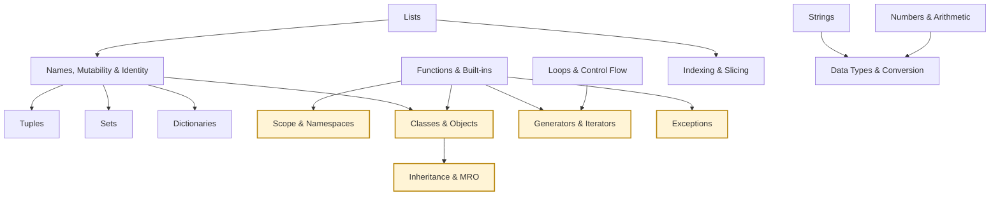

# PyQuiz concept graph and misconception taxonomy

**Status: design proposal (Stage 1), not implemented**, apart from the stable topic ids of §5,
which are decided and implemented as a separate change. This turns the flat topic taxonomy into a curated graph of **concepts** (topic nodes),
**prerequisite edges** and **misconceptions**. The future adaptive engine and AI interviewer can
then reason about *what a learner should learn next* and *which wrong belief a wrong answer
reveals*.

- Stage 2 stores the graph in one config module.
- Stage 3 tags the 47 seed questions' wrong options with misconception ids.
- The ids of the 11 existing topics are **in use** (see §5). The five new topics' ids are
  proposed; they are added to the taxonomy with the new topics.

## 1. Nodes

There are 16 topics: the 11 existing canonical topics plus the 5 new topics you approved (from
`tmp/prodcopy/topic-proposals.md`). Inheritance & MRO and Classes & Objects stay separate.

| Proposed id | Display name | New | Covers |
|---|---|---|---|
| `mutability` | Names, Mutability & Identity | | How names bind to objects: assignment creates references, not copies; mutation vs rebinding; aliasing, including arguments passed to functions, repeated references (`[[0] * 2] * 2`) and shallow copies; `is` (identity) vs `==` (equality); which types are mutable. |
| `loops` | Loops & Control Flow | | `if`/`for`/`while`, `break`/`continue`, the loop `else` clause, `range`, and the order in which statements run. |
| `dicts` | Dictionaries | | Creating, reading and updating dicts: key lookup and missing keys, iteration (keys, `.values()`, `.items()`), views, and which keys count as the same key. |
| `types` | Data Types & Conversion | | Built-in types and converting between them (`int()`, `float()`, `str()`, `bool()`), truthiness, and which operations are defined across types. |
| `strings` | Strings | | String immutability, indexing, and methods that return new strings (`upper`, `strip`, `split`, `replace`, …). |
| `functions` | Functions & Built-ins | | Defining and calling functions: parameters, defaults, return values (including the implicit `None`), and common built-ins (`len`, `sorted`, `zip`, `enumerate`, `print`, …). |
| `sets` | Sets | | Set literals and `set()`, uniqueness, membership, set operations, and that sets are unordered and unindexed. |
| `lists` | Lists | | Creating and changing lists: `append`/`extend`/`insert`/`remove`, in-place methods that return `None`, list repetition and nesting. |
| `slicing` | Indexing & Slicing | | Positive and negative indices, `start:stop:step` slices, out-of-range behaviour, and slicing making a new object. Slicing works on every sequence type: lists, strings and tuples. |
| `tuples` | Tuples | | Tuple syntax (the comma makes the tuple), packing and unpacking, and immutability of the container, not its contents. |
| `numbers` | Numbers & Arithmetic | | `int`/`float` arithmetic: `/` vs `//` vs `%`, floor division with negatives, float precision, `round`, `**`/`pow`. |
| `classes` | Classes & Objects | **new** | Defining and instantiating a single class: `self` and method binding, `__init__`/`__new__`, instance vs class attributes and the lookup fallback between them, default object equality. |
| `inheritance` | Inheritance & MRO | **new** | Subclassing, overriding and polymorphism, `super()`, constructor chaining, multiple inheritance and the method resolution order. |
| `scope` | Scope & Namespaces | **new** | How names are resolved: local vs global, LEGB, `global`/`nonlocal`, shadowing, `UnboundLocalError`, closures, comprehension scope, and the absence of a scope for `for` loops. |
| `generators` | Generators & Iterators | **new** | `yield`, generator expressions, `iter`/`next`, lazy evaluation (including `map`/`filter`/`zip`), exhaustion and `StopIteration`. |
| `exceptions` | Exceptions | **new** | `try`/`except`/`else`/`finally` control flow, `raise`, `assert`, the order `except` clauses are matched in, and what happens after an exception is handled or left uncaught. |

## 2. Prerequisite edges

`A → B` means *a learner should understand A before B*: B's core ideas are defined in terms of A.
Only genuine dependencies are listed, not "related to" links. **Every edge is a plain prerequisite
and means "must come first"** (owner's decision): a topic with several incoming edges needs all of
them. The graph was checked mechanically:
16 nodes, 14 edges, no unknown topics or duplicates, and **acyclic** (a topological sort
succeeds).

| # | Prerequisite → Topic | Reason |
|---|---|---|
| 1 | `lists` → `mutability` | Aliasing and in-place mutation can only be demonstrated with a mutable container, and lists are the first one learners meet. |
| 2 | `lists` → `slicing` | Slicing is defined on sequences, so a learner needs **one sequence type first**. Slicing applies equally to strings and tuples; the edge comes from `lists` because it is the first sequence learners usually meet and the one they slice most. It stands for "one sequence type first", not "lists specifically". |
| 3 | `mutability` → `tuples` | "Tuples are immutable" only makes sense once the mutable/immutable distinction exists; the classic trap is a tuple that holds a mutable list. |
| 4 | `mutability` → `sets` | Set members must be hashable, which is a consequence of immutability. |
| 5 | `mutability` → `dicts` | Dict keys must be hashable, and dict values are references that can be aliased. |
| 6 | `numbers` → `types` | Converting between `int`, `float` and `bool` presupposes knowing how those numeric types behave. |
| 7 | `strings` → `types` | Most conversions go between strings and numbers (`int('3')`, `str(3)`), which presupposes strings. |
| 8 | `functions` → `scope` | Local scopes are created by function calls, so scope rules are about names inside functions. |
| 9 | `functions` → `classes` | Methods are functions whose first parameter is bound to the instance. |
| 10 | `mutability` → `classes` | Whether state is shared or per instance depends on mutating a shared class attribute vs rebinding an instance attribute. |
| 11 | `classes` → `inheritance` | Subclassing, overriding and `super()` all extend single-class behaviour. |
| 12 | `loops` → `generators` | Generators are consumed through the iteration protocol that `for` loops use. |
| 13 | `functions` → `generators` | A generator function is a function containing `yield`; calling it returns an iterator instead of running the body. |
| 14 | `functions` → `exceptions` | Exceptions propagate up the stack of function calls; `finally` and `return` interact inside functions. |

**Roots** (no prerequisites): `loops`, `strings`, `functions`, `lists`, `numbers`.

Deliberately not edges:
- **`loops` → `exceptions`:** `try` is its own control structure, not built on loops.
- **`scope` → `classes`:** attribute lookup is an object mechanism, not LEGB scope.
- **`strings` → `slicing`** and **`tuples` → `slicing`:** any one sequence type suffices before
  slicing, and edge 2 stands for that. Because every edge means "must come first", adding these
  would wrongly require all three. The single `lists` → `slicing` edge is kept.

**Possible future refinement (not implemented):** "any one of" prerequisites, e.g. `slicing`
requiring any one of `lists`, `strings` or `tuples`. The graph has plain edges only for now.

## 3. Misconceptions

Each misconception has a stable id `<topic-id>.<wrong-belief>` and belongs to exactly one topic.

**Placement rule (owner's decision): a misconception belongs to the topic whose correct mental
model fixes it**, not to the topic whose syntax the example happens to use. For example:
- the mutable-default-argument trap belongs to `functions`: the correct model is about *when a
  default is evaluated*, not about lists;
- `[[0] * 2] * 2` sharing its rows uses list syntax, but what fixes it is the reference model
  (`*` repeats references to one object), so it belongs to `mutability`.

**All 59 were checked against the rule.** Four moved:

| Was | Now | Why |
|---|---|---|
| `lists.multiplication-copies-rows` | `mutability.multiplication-copies-rows` | Owner's decision. The fix is that `*` repeats references to the same object. |
| `loops.loop-variable-discarded` | `scope.loop-variable-discarded` | Owner's decision. The fix is that a `for` loop creates no scope. |
| `functions.arguments-are-copied` | `mutability.arguments-are-copied` | The fix is the same reference model as `mutability.assignment-copies`: a parameter is one more name bound to the caller's object. Nothing about functions corrects it. |
| `slicing.slice-copy-is-deep` | `mutability.slice-copy-is-deep` | The fix is shallow vs deep copying (inner objects are shared references). This applies equally to `list(a)` and `a.copy()`, so it isn't a slicing rule. |

Checked and kept where they are, as the closest calls:
- `strings.methods-modify-in-place` and `strings.item-assignment`: the fix is "strings are
  immutable, so methods return new strings", a fact about `str` itself, which `strings` covers.
- `tuples.contents-immutable`: the fix is what tuple immutability means (slots can't be
  rebound), which `tuples` covers. It builds on `mutability` through edge 3.
- `tuples.failed-augmented-assignment-changes-nothing`: the fix combines `+=` mutating in place
  (`mutability`) with the tuple refusing the assignment back. What's new, and only happens with
  tuples, is the second step, so it stays in `tuples`.
- `sets.add-returns-set` and `lists.sort-returns-list`: **these two share one underlying belief**,
  that a method which changes an object returns the changed object. The fix, "mutating methods
  return `None`", is taught per type, and each belief is about that type's method, so they stay
  as two misconceptions in their own topics. The adaptive engine can treat them as related.
- `scope.mutation-needs-global`: it relies on mutation vs rebinding, but the fix is what
  `global` does, which is `scope`.

The other 47 fit the rule without discussion.

Each misconception gives the wrong belief, a minimal example where that belief predicts the wrong
result, what actually happens, and the correct mental model. **Every example was executed on
CPython 3.14.5 and produces exactly the output shown.** The exact wording of error messages
differs between Python versions; the exception types don't. They are all common, widely taught
Python pitfalls; no research is cited.

### `mutability`: Names, Mutability & Identity

| Id | Wrong belief | Example → actual output | Correct model |
|---|---|---|---|
| `mutability.assignment-copies` | `b = a` makes a copy. | `a = [1, 2]; b = a; b.append(3); print(a)` → `[1, 2, 3]` | Assignment binds another name to the **same** object. Copy explicitly (`a.copy()`, `list(a)`, `a[:]`). |
| `mutability.is-means-equal` | `is` compares values, like `==`. | `a = [1, 2]; b = [1, 2]; print(a == b, a is b)` → `True False` | `is` tests identity (same object); `==` tests equality of value. |
| `mutability.augmented-assignment-rebinds` | `b += [2]` makes a new list, like `b = b + [2]`. | `a = [1]; b = a; b += [2]; print(a)` → `[1, 2]` | For mutable types, `+=` mutates in place (`__iadd__`), so every alias sees it. |
| `mutability.rebinding-mutates` | Assigning a new value to a name changes the object other names refer to. | `a = [1]; b = a; b = b + [2]; print(a)` → `[1]` | `b = …` rebinds only `b`; the object `a` refers to is untouched. |
| `mutability.arguments-are-copied` | Passing a list to a function gives it a copy. | `def fill(lst): lst.append(0)`; `items = []; fill(items); print(items)` → `[0]` | Arguments are passed as references to the same objects; mutation inside is visible outside. |
| `mutability.multiplication-copies-rows` | `[[0] * 2] * 2` makes two independent rows. | `grid[0][0] = 1` → `[[1, 0], [1, 0]]` | `*` repeats **references** to the same inner list; build rows with a comprehension. |
| `mutability.slice-copy-is-deep` | `a[:]` copies nested objects too. | `a = [[1]]; b = a[:]; b[0].append(2); print(a)` → `[[1, 2]]` | A slice is a **shallow** copy: a new outer list sharing the same inner objects. |

### `loops`: Loops & Control Flow

| Id | Wrong belief | Example → actual output | Correct model |
|---|---|---|---|
| `loops.remove-while-iterating` | Removing items while looping over a list still visits every item. | `nums = [1, 2, 2, 3]`; remove each `2` inside `for n in nums` → `[1, 2, 3]` | The loop walks indices; removing shifts later items left, so the next one is skipped. Iterate over a copy or build a new list. |
| `loops.range-includes-stop` | `range(1, 5)` includes 5. | `list(range(1, 5))` → `[1, 2, 3, 4]` | `range` stops *before* `stop`. |
| `loops.else-runs-after-break` | A loop's `else` runs when the loop exits via `break` (or always). | loop that `break`s, with `else: print('no break')`, then `print('end')` → `end` | The loop `else` runs only when the loop finishes **without** `break`. |

### `dicts`: Dictionaries

| Id | Wrong belief | Example → actual output | Correct model |
|---|---|---|---|
| `dicts.iteration-yields-pairs` | `for x in d` yields key/value pairs. | `for x in {'a': 1, 'b': 2}: print(x)` → `a` then `b` | Iterating a dict yields its **keys**; use `.items()` for pairs. |
| `dicts.missing-key-returns-none` | `d[key]` returns `None` for a missing key. | `d = {'a': 1}; d['z']` → `KeyError: 'z'` (`d.get('z')` → `None`) | Indexing a missing key raises `KeyError`; `.get()` returns a default. |
| `dicts.keys-view-is-list` | `d.keys()` is a list and can be indexed. | `{'a': 1}.keys()[0]` → `TypeError: 'dict_keys' object is not subscriptable` | `.keys()` returns a view; convert with `list(...)` to index it. |
| `dicts.equal-keys-are-distinct` | `1`, `1.0` and `True` are three different keys. | `{1: 'int', 1.0: 'float', True: 'bool'}` → `{1: 'bool'}` | Keys that are equal and hash equally are the same key: the first key object is kept, and the last value wins. |

### `types`: Data Types & Conversion

| Id | Wrong belief | Example → actual output | Correct model |
|---|---|---|---|
| `types.bool-of-false-string` | `bool('False')` is `False`. | `bool('False'), bool('')` → `True False` | `bool()` of a string tests emptiness, not content: any non-empty string is truthy. |
| `types.int-parses-float-string` | `int()` accepts any numeric-looking string. | `int(3.9)` → `3`, but `int('3.9')` → `ValueError` | `int()` parses integer literals from strings; convert with `int(float(s))` if needed. |
| `types.int-rounds` | `int()` rounds to the nearest integer. | `int(2.7), int(-2.7)` → `2 -2` | `int()` truncates toward zero; use `round()` to round. |
| `types.implicit-str-number-coercion` | Python converts between strings and numbers automatically when you combine them. | `'1' + 1` → `TypeError: can only concatenate str (not "int") to str` | Python doesn't coerce between `str` and numbers; convert explicitly. |

### `strings`: Strings

| Id | Wrong belief | Example → actual output | Correct model |
|---|---|---|---|
| `strings.methods-modify-in-place` | String methods change the string. | `s = 'hi'; s.upper(); print(s)` → `hi` | Strings are immutable; methods return a **new** string that must be assigned. |
| `strings.item-assignment` | You can change one character with `s[i] = …`. | `s = 'cat'; s[0] = 'b'` → `TypeError: 'str' object does not support item assignment` | Build a new string (`'b' + s[1:]`, `replace`, …). |
| `strings.strip-removes-substring` | `strip('an')` removes the substring `'an'` from the ends. | `'banana'.strip('an')` → `b` | The argument is a **set of characters** stripped from both ends; use `removeprefix`/`removesuffix` for substrings. |
| `strings.split-space-equals-split` | `split(' ')` behaves like `split()`. | `'a  b'.split(' ')` → `['a', '', 'b']`; `'a  b'.split()` → `['a', 'b']` | `split()` with no argument splits on runs of whitespace; `split(' ')` splits on every single space. |

### `functions`: Functions & Built-ins

| Id | Wrong belief | Example → actual output | Correct model |
|---|---|---|---|
| `functions.default-argument-fresh` | A default value like `bucket=[]` is created fresh on every call. | `def add(item, bucket=[])` that appends; `add(1)`, then `print(add(2))` → `[1, 2]` | Defaults are evaluated **once**, when the function is defined; use `None` and create the list inside. |
| `functions.print-returns-value` | `print` returns what it printed. | `result = print('hi'); print(result)` → `hi` then `None` | `print` writes to output and returns `None`. |
| `functions.implicit-return-last-value` | A function returns the value of its last expression. | `def double(x): x * 2`; `print(double(3))` → `None` | Without `return`, a function returns `None`. |

### `sets`: Sets

| Id | Wrong belief | Example → actual output | Correct model |
|---|---|---|---|
| `sets.empty-braces-make-set` | `{}` is an empty set. | `type({})`, `type(set())` → `dict set` | `{}` is an empty **dict**; an empty set is `set()`. |
| `sets.indexable` | Sets can be indexed like lists. | `{10, 20}[0]` → `TypeError: 'set' object is not subscriptable` | Sets are unordered collections without positions. |
| `sets.add-returns-set` | `s.add(x)` returns the updated set. | `s = {1}; s = s.add(2); print(s)` → `None` | `add` mutates in place and returns `None`. |

### `lists`: Lists

| Id | Wrong belief | Example → actual output | Correct model |
|---|---|---|---|
| `lists.sort-returns-list` | `nums.sort()` returns the sorted list. | `result = [3, 1, 2].sort()` → `None` (the list itself is sorted) | In-place methods return `None`; `sorted(nums)` returns a new list. |
| `lists.append-extends` | `append([3, 4])` adds two items. | `a = [1, 2]; a.append([3, 4])` → `[1, 2, [3, 4]]`, length 3 | `append` adds one object (here, a list); `extend` adds each item. |
| `lists.assignment-extends` | Assigning past the end grows the list. | `a = [1]; a[3] = 2` → `IndexError: list assignment index out of range` | Indices must exist; use `append`/`extend`/`insert` to grow a list. |

### `slicing`: Indexing & Slicing

| Id | Wrong belief | Example → actual output | Correct model |
|---|---|---|---|
| `slicing.stop-inclusive` | A slice includes the `stop` index. | `'python'[1:3]` → `yt` | Slices are half-open: `start` included, `stop` excluded. |
| `slicing.out-of-range-raises` | Slicing beyond the end raises an error, like indexing. | `[1, 2][5:]` → `[]`, but `[1, 2][5]` → `IndexError` | Slice bounds are clipped to the sequence; single indices must exist. |

### `tuples`: Tuples

| Id | Wrong belief | Example → actual output | Correct model |
|---|---|---|---|
| `tuples.parentheses-make-tuple` | Parentheses create a tuple. | `type((1))`, `type((1,))` → `int tuple` | The **comma** makes the tuple; parentheses only group. |
| `tuples.contents-immutable` | A tuple's contents can never change. | `t = ([1],); t[0].append(2); print(t)` → `([1, 2],)` | The tuple can't be rebound slot by slot, but mutable objects inside it can still change. |
| `tuples.failed-augmented-assignment-changes-nothing` | If `t[0] += [2]` raises an error, nothing changed. | the `+=` raises `TypeError`, then `print(t)` → `([1, 2],)` | `+=` first mutates the list in place, **then** fails to assign back into the tuple, so the error comes after the change. |

### `numbers`: Numbers & Arithmetic

| Id | Wrong belief | Example → actual output | Correct model |
|---|---|---|---|
| `numbers.slash-is-integer-division` | `7 / 2` is `3`. | `7 / 2, 7 // 2` → `3.5 3` | In Python 3, `/` is true division and always gives a float; `//` is floor division. |
| `numbers.floor-division-truncates` | `-7 // 2` is `-3`. | `-7 // 2` → `-4` | `//` rounds **down** (toward negative infinity), not toward zero. |
| `numbers.floats-are-exact` | `0.1 + 0.2 == 0.3`. | → `False 0.30000000000000004` | Binary floats can't represent most decimals exactly; compare with a tolerance (`math.isclose`). |
| `numbers.round-half-up` | `round(2.5)` is `3`. | `round(2.5), round(3.5)` → `2 4` | `round` uses round-half-to-even ("banker's rounding"). |

### `classes`: Classes & Objects (new)

| Id | Wrong belief | Example → actual output | Correct model |
|---|---|---|---|
| `classes.class-attribute-per-instance` | A list defined in the class body is separate for each instance. | `class Cart: items = []`; `a.items.append('apple')`; `print(b.items)` → `['apple']` | Class attributes are one object shared by all instances; create per-instance state in `__init__`. |
| `classes.augmented-assignment-updates-class` | `obj.n += 1` updates the class attribute `n`. | `class Counter: n = 0`; `c.n += 1`; `print(Counter.n, c.n)` → `0 1` | It reads the class value, then **creates an instance attribute** that shadows it. |
| `classes.self-is-optional` | Methods don't need a `self` parameter. | `def hello(): …` in a class; `Greeter().hello()` → `TypeError: … takes 0 positional arguments but 1 was given` | Calling a method on an instance passes the instance as the first argument. |
| `classes.equality-compares-attributes` | Two instances with the same attributes are `==`. | `Point(1) == Point(1)` → `False` | By default `==` falls back to identity; define `__eq__` for value equality. |

### `inheritance`: Inheritance & MRO (new)

| Id | Wrong belief | Example → actual output | Correct model |
|---|---|---|---|
| `inheritance.parent-init-runs-automatically` | A subclass `__init__` automatically runs the parent's `__init__`. | `B(A)` defines its own `__init__`; `B().x` → `AttributeError: 'B' object has no attribute 'x'` | Overriding `__init__` replaces it; call `super().__init__()` explicitly. |
| `inheritance.super-means-parent-class` | `super()` always calls the direct parent class. | diamond `D(B, C)`, each `f` prints and calls `super().f()`; `D().f()` → `D B C A` | `super()` calls the **next class in the instance's MRO**, which can be a sibling (`C`), not the parent (`A`). |
| `inheritance.mro-depth-first` | The method resolution order is depth-first (`D, B, A, C`). | `D.__mro__` for `D(B, C)` → `['D', 'B', 'C', 'A', 'object']` | Python uses the C3 linearization: a class always comes before its bases, and the base order is kept. |

### `scope`: Scope & Namespaces (new)

| Id | Wrong belief | Example → actual output | Correct model |
|---|---|---|---|
| `scope.assignment-reads-global-first` | A function can read a global and assign it later in the same function. | `x = 1; def f(): print(x); x = 2`; `f()` → `UnboundLocalError` | Any assignment in a function makes the name local for the **whole** function body; use `global` to assign the global. |
| `scope.mutation-needs-global` | `global` is needed to change a global list. | `items = []; def add(): items.append(1)`; `add(); print(items)` → `[1]` | `global` is only needed to **rebind** a name; mutating the object it refers to needs no declaration. |
| `scope.closures-capture-values` | A lambda remembers the loop variable's value at creation. | `[lambda: i for i in range(3)]`, each called → `[2, 2, 2]` | Closures capture the **variable**, looked up when called (late binding); bind with a default (`lambda i=i: i`). |
| `scope.comprehension-variable-leaks` | A comprehension's loop variable is still defined afterwards. | `[n * n for n in range(3)]`; `print(n)` → `NameError: name 'n' is not defined` | In Python 3, comprehensions have their own scope (unlike a `for` loop). |
| `scope.loop-variable-discarded` | The loop variable disappears after the loop. | `for i in range(3): pass` then `print(i)` → `2` | A `for` loop doesn't create a scope; the variable keeps its last value. |

### `generators`: Generators & Iterators (new)

| Id | Wrong belief | Example → actual output | Correct model |
|---|---|---|---|
| `generators.reusable` | A generator can be iterated more than once. | `g = (x for x in range(3))`; `list(g)` twice → `[0, 1, 2]` then `[]` | Generators are single-use iterators; once exhausted they yield nothing. |
| `generators.call-runs-body` | Calling a generator function runs its body. | `g = gen()` prints nothing; `next(g)` → `started` then `1` | Calling it only creates the generator; the body runs lazily on `next()`. |
| `generators.map-returns-list` | `map`/`filter`/`zip` return lists. | `len(map(str, [1, 2]))` → `TypeError: object of type 'map' has no len()` | In Python 3 they return lazy iterators; wrap in `list(...)` to materialize. |

### `exceptions`: Exceptions (new)

| Id | Wrong belief | Example → actual output | Correct model |
|---|---|---|---|
| `exceptions.return-skips-finally` | `return` inside `try` skips `finally`. | `try: return 'result' finally: print('cleanup')` → `cleanup` then `result` | `finally` always runs on the way out, even on `return`. |
| `exceptions.most-specific-handler-wins` | The most specific matching `except` clause is chosen. | `except Exception` listed before `except ValueError`; `int('x')` → `general` | Clauses are tried **in order**; the first match wins, so put specific handlers first. |
| `exceptions.else-always-runs` | A `try` statement's `else` block always runs. | `1 / 0` caught; `else: print('else')` → only `caught` | `else` runs only if the `try` block raised nothing. |
| `exceptions.caught-exception-keeps-propagating` | An error still stops the program even after it's caught. | `raise ValueError` caught, then `print('continues')` → `handled` then `continues` | A handled exception is finished; execution continues after the `try` statement. |

**Totals: 59 misconceptions across 16 topics**, 2–7 per topic: `mutability` 7; `scope` 5; `dicts`, `types`, `strings`, `numbers`, `classes` and `exceptions` 4 each; `loops`, `functions`, `sets`, `lists`, `tuples`, `inheritance` and `generators` 3 each; `slicing` 2.

## 4. Diagram

Arrows point from prerequisite to dependent topic. New topics are highlighted.

## 5. DECISION: display names vs stable topic ids

**Decided by the owner: Option A, stable ids, now, with no backwards compatibility. Implemented.**
- The proposed ids are used unchanged.
- **Rule:** an id never changes once set; a display name can change freely.
- Ids are stored and passed everywhere topics are stored or passed: questions, quiz sessions, API
  parameters and responses, and the frontend. Display names live only in
  `backend/config/topicTaxonomy.js`, served by the new `GET /api/v1/topics`.
- Display names are **not** accepted on input any more: they get 400. The breaking API changes are
  listed in `docs/FINAL_REPORT.md` §3 (row 15).
- The local dev database was converted with `backend/scripts/migrateTopicIds.js` (dry run by
  default, idempotent, native driver, `autoIndex` off). The paused production migration now writes
  ids directly (`docs/FIX_PLAN.md`, "Deployment preparation (paused)").
- The comma bug below is fixed, and `backend/tests/topicIds.test.js` and
  `e2e/tests/topics.spec.js` guard it.

The rest of this section is the analysis as written before the decision.

### How topics were stored before the decision

**By display name, everywhere:**
- **Questions:** `Question.primaryTopic` and `secondaryTopics` hold the literal strings from
  `backend/config/topicTaxonomy.js` (e.g. `"Names, Mutability & Identity"`), as a Mongoose enum.
- **Sessions:** `QuizSession.filters.topics` stores the names the learner picked.
- **API:** every topic-bearing API field and parameter uses the names: `GET /questions/topics`, the
  `?topics=` filters, the session-start body, the admin forms, `topic-mastery` and `stats`.
- **Frontend:** it keeps its own copy of the list (`frontend/public/js/topicTaxonomy.js`).
- **Not affected:** `AnswerEvent` and `UserAnsweredQuestion` store no topic, since mastery joins
  through the question.

### A live bug found while checking this

`GET /api/v1/questions?topics=` and the Study/admin filters split the parameter on commas
(`csvToArray`). **"Names, Mutability & Identity" contains a comma**, so filtering by the largest
topic returns 400 "Validation failed": it is split into "Names" and " Mutability & Identity".
Reproduced against the dev backend:
- `?topics=Lists` → 200;
- `?topics=Names%2C%20Mutability%20%26%20Identity` → 400.

It affects Study mode, the admin question list and `GET /questions/random`. Quiz sessions send a
JSON array and are unaffected. It dates from the Phase 3 taxonomy commit (`39aa508`). Not fixed
here, since Stage 1 is design only.

### Options

**A. Add stable ids now**, before Stage 2 and before the paused production migration (M2) runs.
The database, the API and the misconception ids use the ids (`mutability`, `classes`, …), and
display names live only in the config, for the UI.
- *Pros:*
  - **The production migration writes ids once.** M2 hasn't run, so production's `topics` would go
    straight to the final form, with no second migration of real data later.
  - Display names can be renamed freely, with no data migration.
  - Removes the comma bug structurally (ids contain no commas).
  - Misconception ids (`mutability.assignment-copies`) and graph edges use the same keys as the
    stored data, which is what the adaptive engine and AI interviewer will query.
- *Cons:*
  - It is an API change for topic fields and parameters (the frontend is updated in the same
    change).
  - It touches the model, validators, services, frontend and tests, and needs a small local-dev
    data migration (47 seed questions; quiz sessions expire within 24 h).
  - The paused production runbook must be updated so M2 writes ids.

**B. Keep display names; add ids later.** The graph config maps names to ids internally for now.
- *Pros:* a smaller change now; the Stage 2 work proceeds as written.
- *Cons:*
  - When production is migrated (M2 writes names), **a second migration of real data** from names
    to ids is needed later.
  - The API changes later, when more clients depend on it.
  - Every display-name rename in between is a data migration.
  - The comma bug needs a separate fix (e.g. a different separator or repeated parameters).
  - Misconception ids and stored topics use different keys.

**Recommendation: A**, as its own small, separately reviewed change **before** Stage 2 and before
resuming the production migration. Keep the API backwards-compatible for one release if you want,
accepting either an id or a display name on input, so that it isn't a hard break. Not changed
here, pending your decision.

## Open points for review

1. **Topic ids:** *resolved*: the proposed ids were accepted and implemented (§5).
2. **Edges:** *resolved*: all 14 kept, including `lists → slicing` (read as "one sequence type
   first", §2) and `mutability → classes`.
3. **Misconception ownership:** *resolved*: the placement rule in §3; four misconceptions moved.
4. **§5 decision:** *resolved*: stable ids now, implemented (§5).
