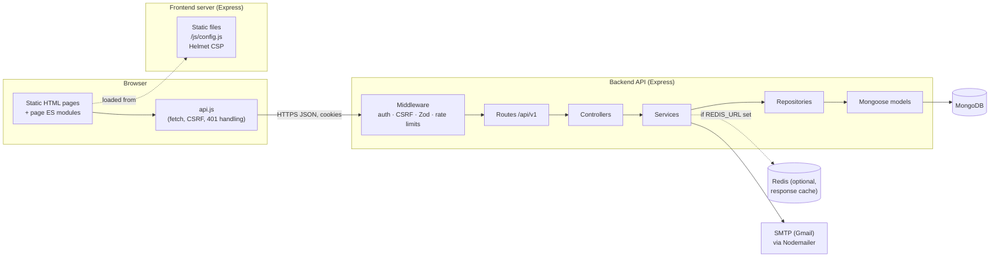
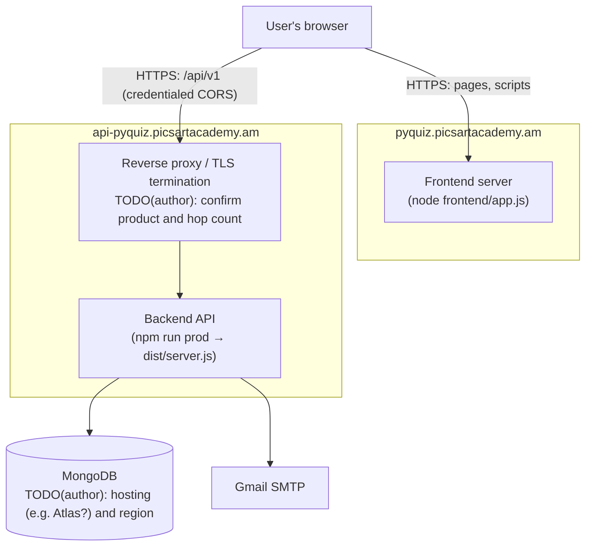
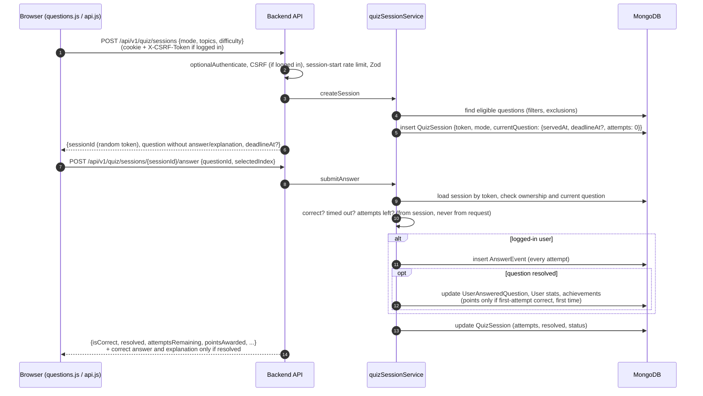
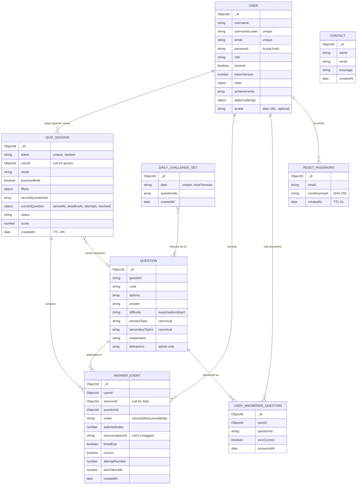

# PyQuiz: An Interactive Platform for Python Knowledge Assessment and Practice

> TODO(author): the thesis title is still being decided. This document's title is the project's
> working title and has deliberately not been changed; replace or confirm it once the thesis title
> is final.

**A description of the current implementation, prepared for thesis documentation**

Repository: https://github.com/HaykuhiMk/PyQuiz
Live application: https://pyquiz.picsartacademy.am/

---

## 1. Project Overview

PyQuiz is a full-stack web application for testing, practising and tracking knowledge of the
Python programming language through multiple-choice questions. It combines four ways of working
with one question bank:
- three quiz modes (Classic, Blitz and Survival);
- a Study mode that shows answers and explanations;
- a Daily Challenge that is the same for everyone on a given day;
- a public leaderboard.

A personal dashboard records each registered user's points, streaks, accuracy and per-topic mastery.

The system is a client–server application. A Node.js/Express backend exposes a versioned REST API
(`/api/v1`) backed by MongoDB, and a separate, framework-free frontend of static HTML pages and
vanilla JavaScript modules consumes that API. Registered users have their progress persisted.
Guests can play quizzes immediately without an account, but nothing about a guest's play is
stored.

The intended users are learners of Python — students on a course, self-taught programmers, or
candidates preparing for technical interviews — who want a focused tool for checking their
understanding of language fundamentals. A secondary audience is whoever maintains the platform,
through its administrative panel for managing questions, users and contact messages.

## 2. Motivation and Problem Statement

Reading documentation or tutorials produces a feeling of familiarity that does not always match an
ability to predict, without hints, what a piece of code will do. Learners often discover such gaps
only when they matter most — in an interview, an exam or a debugging session — because untimed
reading rarely exposes them in advance.

Common self-assessment options each cover only part of the need:
- **Static worksheets** give no immediate feedback and no record of improvement.
- **General-purpose quiz tools** are not scoped to one subject and do not show which sub-topics
  are weak.
- **Competition-driven coding platforms** emphasise ranking over structured review of
  fundamentals.

A comparison with specific existing tools is left to Section 15 (Related Work).

PyQuiz addresses this with a single tool scoped to Python fundamentals that provides several
things together:
- immediate feedback on every answer;
- more than one mode of practice (self-paced, timed, and single-mistake);
- a per-topic record of performance.

A score is only useful as a picture of what a learner knows if it cannot simply be manufactured by
the browser. In PyQuiz the server therefore decides which question is being answered, whether the
answer is correct, how many attempts remain and how many points are awarded. What this does and
does not guarantee is stated precisely in Section 6.4.

## 3. Project Goals and Objectives

The overall goal is a reliable and secure platform for practising and assessing Python knowledge
through short, explained multiple-choice questions, with visibility into one's own progress over
time. The concrete objectives, each implemented in the current codebase, are:

- Account-based access (registration, login, logout, password recovery) alongside a guest mode for
  unauthenticated practice.
- Several ways to use the same question bank: self-paced (Classic), timed (Blitz), single-mistake
  (Survival), review (Study) and a shared Daily Challenge.
- Server-authoritative assessment:
  - The server serves each question, checks each answer and awards all points.
  - The correct answer and explanation are sent to the browser only once the question has been
    resolved (Section 6.4).
- A dashboard with points, rank, streaks, overall accuracy, progress through the question bank, and
  per-topic coverage and accuracy.
- Simple, rule-based gamification: five achievements, points, streaks and a leaderboard.
- Administrative tooling for question management, user moderation and contact-message review.
- Security measures appropriate to storing credentials and personal statistics (Section 12).
- A responsive, light/dark, keyboard-accessible interface (Section 14).

## 4. Requirements

The requirements below are stated as the current implementation satisfies them. Each is traced to
the section describing the feature, and to the automated tests (Section 13) that exercise it.
Backend test files live in `backend/tests/`, and browser tests in `e2e/tests/`.

### 4.1 Functional requirements

| ID | Requirement | Feature | Verified by |
|---|---|---|---|
| FR-1 | A visitor can register with a username, email and password satisfying the password rule; usernames are unique case-insensitively. | §5.1 | `auth.test.js`, `passwordPolicy.test.js`, `validation.spec.js` |
| FR-2 | A registered user can log in and log out; login state is confirmed by the server. | §5.1 | `auth.test.js`, `sessionSecurity.test.js`, `smoke.spec.js` |
| FR-3 | A user can reset a forgotten password via an emailed, single-use link valid for one hour. | §5.1 | `passwordReset.test.js` |
| FR-4 | A guest can play Classic, Blitz and Survival quizzes without an account; nothing is persisted for guests. | §5.1, §6 | `quizSessions.test.js`, `smoke.spec.js` |
| FR-5 | A user can start a quiz in Classic, Blitz or Survival mode, filtered by difficulty and topics. | §6 | `quizSessions.test.js`, `quizSessionsPractice.test.js`, `smoke.spec.js` |
| FR-6 | The server decides correctness, attempts, timing and points for every quiz answer. | §6.4 | `quizSessions.test.js` |
| FR-7 | A logged-in user can study questions with answers and explanations, excluding today's Daily Challenge questions. | §5.4 | `progress.test.js` |
| FR-8 | A logged-in user can complete one Daily Challenge per day (Asia/Yerevan), identical for all users that day. | §5.5 | `dailyChallenge.test.js`, `smoke.spec.js` |
| FR-9 | A logged-in user sees a dashboard with points, rank, streaks, accuracy and progress. | §5.7 | `progress.test.js`, `quizSessions.test.js` |
| FR-10 | A logged-in user sees per-topic coverage, accuracy and mastery level, and a list of weak topics. | §5.8 | `topicMastery.test.js` |
| FR-11 | The system awards achievements, points and streaks according to fixed rules. | §5.9 | `quizSessions.test.js` |
| FR-12 | Anyone can view the leaderboard; a logged-in viewer's own row is marked by the server. | §5.10 | `leaderboard.test.js` |
| FR-13 | A user can change username, avatar and password, choose a theme, and delete their account together with all data linked to it. | §5.11 | `accountDeletion.test.js`, `auth.test.js`, `avatarUpload.test.js`, `passwordPolicy.test.js`, `passwordWhitespace.test.js`, `validation.spec.js`, `smoke.spec.js` |
| FR-14 | An admin can list, view, add, edit and delete questions, restricted to the canonical topic taxonomy. | §5.12 | `adminQuestions.test.js`, `adminQuestionTopics.test.js` |
| FR-15 | An admin can list users and ban or unban non-admin accounts. | §5.12 | `adminUsers.test.js` |
| FR-16 | An admin can read contact-form messages. | §5.12 | `adminContacts.test.js` |
| FR-17 | A visitor can send a contact message, which is stored and emailed to the admin. | §5.13 | `contact.test.js` |
| FR-18 | The About page shows live question and topic counts without exposing question content. | §5.13 | `publicStats.test.js`, `smoke.spec.js` |

### 4.2 Non-functional requirements

| ID | Requirement | Where | Verified by |
|---|---|---|---|
| NFR-1 | **Integrity:** quiz scoring cannot be forged from the browser, and no public endpoint returns correct answers or explanations. | §6.4 | `quizSessions.test.js`, `progress.test.js` |
| NFR-2 | **Session security:** sessions live in httpOnly cookies, are invalidated on ban, password change and password reset, and state changes require an HMAC-bound CSRF token. | §12 | `sessionSecurity.test.js`, `adminSession.test.js`, `bearerRejected.test.js`, `cors.test.js`, `admin.spec.js` |
| NFR-3 | **Credential protection:** passwords are hashed, reset tokens are stored only as hashes, and login responses reveal neither whether an account exists nor, through timing, whether it does. | §12 | `passwordReset.test.js`, `loginTiming.test.js`, `adminQuestions.test.js` |
| NFR-4 | **Input validation:** every endpoint that accepts input validates it with a Zod schema; client-side password and avatar checks are derived from the server's rules. | §12 | `validationRules.test.js`, `queryValidation.test.js`, `validation.spec.js` |
| NFR-5 | **Abuse resistance:** rate limits on all API traffic and stricter limits on authentication, contact and session-start endpoints. | §12 | `trustProxy.test.js`, `rateLimitBypass.test.js` |
| NFR-6 | **Operational exposure:** in production, `/metrics` requires a bearer token and `/api-docs` is off unless explicitly enabled. | §12 | `productionExposure.test.js` |
| NFR-7 | **Browser hardening:** a Content-Security-Policy without inline scripts; no page produces CSP violations. | §12 | `productionExposure.test.js`, all Playwright tests (fixture) |
| NFR-8 | **Maintainability and consistency:** layered backend (routes → controllers → services → repositories → models); API documentation kept in sync with the real routes; one error shape for every error response; one user lookup per request. | §8, §11, §12 | `swagger.test.js`, `errorShapes.test.js`, `singleLookup.test.js`, `errors.spec.js` |
| NFR-9 | **Usability and accessibility:** responsive layout, light/dark themes, keyboard operability, and reduced-motion support. | §14 | `smoke.spec.js` (theme); TODO(author): no automated accessibility test exists |
| NFR-10 | **Performance:** measured on one local machine only (Section 18.1); no production capacity target has been defined. | §18.1 | `backend/scripts/benchmark.js`; TODO(author): define a target if the thesis needs one |

## 5. System Functionality

### 5.1 Registration, Authentication and Guest Access

**Registration.** New users register with a username (2–50 characters), an email address and a
password. The password must satisfy the single password rule shared by registration, reset and
password change:
- at least 8 characters;
- at least one lowercase letter, one uppercase letter and one digit;
- at least one of `@ $ ! % * ? & _`;
- other characters, including spaces, are allowed.

Passwords are never trimmed, so a password works exactly as typed. Registration fails if the email
is already in use, or if the username matches an existing one ignoring case.

**Login.** Login and the session model are described in Section 12. The frontend decides whether a
user is logged in by asking the server (`GET /api/v1/auth/me`). On any expired or revoked session
it clears its state and returns to the login page.

**Guest mode.** "Continue as guest" on the landing page takes the visitor straight into the quiz.
- **Guests can:** play Classic, Blitz and Survival quizzes, and view the leaderboard.
- **Guests are redirected to login from:** Study mode, the Daily Challenge, the Dashboard and
  Settings, all of which require an account.
- **In the interface:** quiz screens show a "Guest Mode" notice, and the results screen omits
  points for guests.

**Password recovery.** A user requests a reset link by email.
- The response is identical whether or not the address is registered.
- For a registered address, a random reset key is emailed as a link and expires after one hour.
- Using the key sets the new password and deletes the key.

### 5.2 Quizzes

A user chooses a mode (Section 6), optionally a difficulty, and at least one topic. The server then
serves questions one at a time from the filtered pool. Each question shows:
- its prompt;
- an optional Python code snippet, highlighted with Prism.js;
- lettered answer options.

The browser sends only the question id and the index of the chosen option.

### 5.3 Topics and Difficulty Levels

**Topics.** The question bank uses a fixed taxonomy of **11 canonical topics**:
- Names, Mutability & Identity
- Loops & Control Flow
- Dictionaries
- Data Types & Conversion
- Strings
- Functions & Built-ins
- Sets
- Lists
- Indexing & Slicing
- Tuples
- Numbers & Arithmetic

**Stable ids.** Each topic has a short, stable id (`mutability`, `loops`, `dicts`, `types`,
`strings`, `functions`, `sets`, `lists`, `slicing`, `tuples`, `numbers`). Questions, quiz sessions,
API parameters and API responses store and pass only ids. The display names above live only in
`backend/config/topicTaxonomy.js`, and the frontend reads them from `GET /api/v1/topics`. An id
never changes once set, but a display name can change freely without a data migration.

**Tagging.** Every question has exactly one required **primary topic**: the concept a learner must
understand to answer it. A question may also have optional **secondary topics** for filtering. Quiz
and Study topic filters match a question by its primary *or* any secondary topic.

**Counts.** The bundled dataset contains **47 questions**: 25 easy, 18 medium and 4 hard.

| Primary topic | Questions |
|---|---|
| Names, Mutability & Identity | 12 |
| Loops & Control Flow | 6 |
| Dictionaries | 6 |
| Data Types & Conversion | 5 |
| Strings | 4 |
| Functions & Built-ins | 4 |
| Sets | 4 |
| Lists | 3 |
| Indexing & Slicing | 2 |
| Tuples | 1 |
| Numbers & Arithmetic | 0 |

**Visibility.** Topics with no primary questions are hidden from filters and from the mastery list.
With the current data that is Numbers & Arithmetic, so **10 topics are visible**. Admins add
questions through the admin panel, restricted to the canonical list.

### 5.4 Study Mode

Study mode requires login. It lists questions as paginated cards showing the question, code,
options with the correct one marked, and the explanation, filtered by topic and difficulty. No
scoring is involved.

Today's Daily Challenge questions are excluded from Study mode until the next daily reset, so the
day's answers cannot be looked up there. Other questions' answers are visible by design; see
Section 6.4 for what this means for quiz integrity.

### 5.5 Daily Challenge

The Daily Challenge gives every logged-in user the same **5 questions** each day.

**The day.** A "day" is a calendar day in the **Asia/Yerevan** time zone. The page shows the time
until the next reset, computed by the server as the next Yerevan midnight.

**Selecting the set.** On the first request of a day, the server:
1. computes `HMAC-SHA256(DAILY_CHALLENGE_SEED_SECRET, date)`;
2. uses the digest to seed the `mulberry32` pseudo-random generator;
3. shuffles all question ids with a Fisher–Yates shuffle driven by that generator;
4. takes the first five ids.

Because the seed depends on a server secret, a day's selection cannot be predicted in advance
without that secret.

**Freezing the set.** The selected ids are stored as that day's `DailyChallengeSet`. Every later
request that day reads the stored set, so it cannot change during the day even when questions are
added. A question deleted after freezing is dropped from that day's set rather than causing an
error. If the secret is not configured when a new day's set is needed, the endpoint returns 503 and
never falls back to a predictable seed.

**Submitting.** A user answers all questions and submits them once. A second submission that day is
rejected, including two concurrent submissions. Each correct answer is worth a flat **20 points**,
awarded in addition to (and independent of) the first-attempt rule in Section 6.3. Answers count
toward streaks, accuracy and mastery exactly like first-attempt quiz answers.

### 5.6 Results and Feedback

**After each answer.** The chosen option is marked immediately. Once the question is resolved
(Section 6.4), the correct option and its explanation are shown.

**Results screen.** At the end of a quiz, or when a Survival run ends, the results screen shows:
- the number of questions answered and answered correctly;
- accuracy;
- the best streak in the session;
- for logged-in users, points;
- a colour-coded "ribbon" replaying the sequence of outcomes.

When a correct answer earns 0 points, the server explains why:
- `not_first_attempt`: the answer came on attempt 2 or 3;
- `already_mastered`: the user has answered this question correctly on a first attempt before.

### 5.7 Dashboard

The dashboard shows the user's rank, points, streaks, accuracy and progress:
- **Rank:** Beginner (0–49 points), Intermediate (50–199), Advanced (200–499) or Python Master
  (500 or more).
- **Points:** total accumulated points.
- **Streaks:** current and best streak.
- **"Questions answered correctly"** (overall accuracy) = questions answered correctly ÷ questions
  answered. Each question counts once, when it is resolved, and counts as correct if it was
  answered correctly on any attempt. The dashboard labels it this way, with help text saying so,
  so that it cannot be confused with the per-topic "Attempts correct" (Section 5.8), which counts
  every attempt.
- **Progress:** questions answered out of questions available.

It also shows the day's Daily Challenge status, unlocked achievements and the topic mastery list.

### 5.8 Topic Mastery and Weak Topics

Mastery is computed live on every request from the stored records, never from a counter that could
drift, and uses **primary topics only**. For each topic the server computes two measures:

- **Coverage** = questions in the topic the user has ever answered ÷ questions currently in the
  topic, as a percentage. It comes from `UserAnsweredQuestion`, joined against the current
  questions.
- **Accuracy**, shown as **"Attempts correct"** = correct attempts ÷ all recorded attempts on the
  topic's questions, as a percentage. It comes from `AnswerEvent`, which stores one document per
  attempt, so attempts 2 and 3 count too.

On the dashboard, the weak-topic cards show "Attempts correct", with help text saying it counts
every try, including second and third attempts. The mastery list's bar shows coverage, with help
text saying so. Because the two measures count different things, a user who needed several
attempts can see a lower "Attempts correct" than "Questions answered correctly".

Each topic then gets one level, checked in this order:

| Level | Condition |
|---|---|
| `unavailable` ("Not enough questions yet") | the topic has fewer than **3** questions (`MIN_QUESTIONS_FOR_MASTERY`) |
| `new` | coverage is 0 |
| `measuring` ("Not enough attempts yet") | fewer than **3** recorded attempts (`MIN_ACCURACY_EVENTS`) |
| `master` | coverage ≥ **80%** and accuracy ≥ **70%** |
| `intermediate` | coverage ≥ **50%** |
| `beginner` | otherwise |

**Weak topics.** A topic appears in the "needs practice" list when it has at least 3 recorded
attempts, its accuracy is below **60%**, and it is not `unavailable` or `measuring`. At most **5**
weak topics are shown, lowest accuracy first. All thresholds are named constants in
`backend/config/masteryConfig.js`.

### 5.9 Achievements, Points and Streaks

**Achievements.** There are five, checked on the server after every scored answer. Each records its
unlock time the first time its condition holds:
- `first_correct`: one correct answer;
- `streak_5`: best streak of 5;
- `streak_10`: best streak of 10;
- `points_100`: 100 points;
- `points_500`: 500 points.

**Points** (the full rules are in Section 6.3):
- Classic: 10 per question.
- Survival: 15 per question.
- Blitz: 12 per question, plus a time bonus of `max(0, 10 − ⌊seconds since the question was served ÷
  3⌋)`, measured by the server.
- Daily Challenge: 20 per correct answer.

**Streaks.** The current streak counts consecutive questions answered correctly on the *first*
attempt, updated when each question is resolved. Any other outcome resets it to 0: a wrong
Survival answer, a correct answer on attempt 2 or 3, a Blitz timeout, or a revealed answer. The
best streak is stored separately.

### 5.10 Leaderboard

The leaderboard is public. It ranks users by total points, then best streak, then username, and
shows 50 rows by default. The API accepts a `limit` from 1 to 100 and rejects anything else with a
400. For a logged-in viewer, the server marks the viewer's own row
(`isCurrentUser`). Avatars are never included in the leaderboard response.

### 5.11 Settings and Account Management

A logged-in user can do the following in Settings:
- change their username;
- upload or remove a profile photo;
- change their password (current password required; same rule as registration);
- choose light or dark theme;
- delete their account (password required; admin accounts cannot be deleted here).

**Photo size limit.** The photo is stored as a data URL of at most 500,000 characters. After base64
encoding, that is a JPEG, PNG or WebP file of at most **374,982 bytes (366 KB)**. The picker refuses
a larger file before any upload, and the server applies the same limit with the same message.

**After a password change,** every existing session is signed out, including the current one, and
the user logs in again.

**Deleting an account** removes the user record and everything linked to it:
- the answered-question records (`UserAnsweredQuestion`);
- the per-attempt log (`AnswerEvent`);
- quiz sessions (`QuizSession`);
- any pending password-reset key for the account's email (`ResetPassword`).

The account's sessions stop working immediately. Contact-form messages sent from the same email are
kept, because they are messages to the administrator rather than account data (they can be sent
without an account). A test checks every collection with a `userId` field after deletion (Section
13).

### 5.12 Administrative Functionality

The admin area has its own login page and its own session (Section 12). It supports three areas of
work.

**Question management.**
- List questions with filters, and view any question in full.
- Add, edit and delete questions.
- The primary topic must be from the canonical list, and secondary topics may not repeat it.
- The correct answer must always be one of the options.
- Deleting a question also deletes users' answered-question records for it.

**User management.** List users, and ban or unban non-admin accounts. A ban signs the user out
immediately (Section 12).

**Contact messages.** A paginated, read-only list of submitted messages.

### 5.13 Other Features

**Contact form.** The public contact form stores each message and emails it to the administrator
address. No reply is sent to the submitter. A hidden "honeypot" field silently discards automated
submissions.

**About page.** It shows live question and topic counts from `GET /api/v1/questions/stats`, which
returns only those two numbers.

**Operational endpoints.** The backend exposes:
- `/healthz` (liveness);
- `/readyz` (reflects the database connection);
- `/metrics` (Prometheus format);
- `/api-docs` (Swagger UI documenting every endpoint).

Exposure in production is covered in Section 12.

## 6. Quiz Modes and Assessment Methodology

### 6.1 Quiz sessions

Every quiz runs as a **quiz session** stored on the server (`QuizSession`).

**Starting a session.** Starting a quiz creates a session recording:
- the mode and the filters;
- the questions already served;
- the current question, with when it was served and how many attempts were used.

The client receives an opaque, random 64-character session token rather than a database id.
Sessions expire 24 hours after creation.

**Access.** A session belonging to a logged-in user can be driven only by that user; any other,
unknown or malformed token gets 404. Guests use the same flow with no user attached.

**Serving questions.** The server chooses each next question from the filtered pool, excluding
questions already served in the session. In Classic it also excludes questions the user has already
answered correctly on a first attempt (Section 6.2). A client cannot skip an unanswered question for
free:
- in Classic, "next" is refused until the current question is resolved;
- in Blitz, "next" scores the current question as a timeout.

### 6.2 The three modes

**Classic mode** is untimed.
- **Attempts:** a question allows up to **3 attempts**. After the third wrong attempt, the user can
  explicitly *reveal* the answer, which scores the question as incorrect.
- **Exclusion:** questions the user has ever answered correctly on a *first* attempt are not served
  again. A question answered only wrongly, or only right on attempt 2 or 3, can come back.
- **Exhausted pool:** when no eligible question is left, the user is offered "Practice again (no
  points)", a practice session that ignores the exclusion, or "Widen filters".

**Blitz mode** gives each question **45 seconds**.
- **Deadline:** fixed by the server when the question is served (served time + 45 s, plus 1.5 s of
  unannounced grace for network latency). It is never extended or paused, including by wrong
  attempts.
- **Attempts:** the same 3-attempt cap as Classic applies. Every attempt is checked against the same
  deadline.
- **Timeout:** an answer after the deadline is scored as a timeout and resolves the question,
  regardless of remaining attempts. The on-screen countdown only displays time remaining to the
  server's deadline.

**Survival mode** allows **one attempt**. The first wrong answer ends the session; further answers
or "next" requests are rejected.

### 6.3 Scoring

A correct answer earns the mode's points (Section 5.9) **only if it is a first-attempt correct
answer to a question the user has never before answered correctly on a first attempt**, in any
mode or session.

A correct answer on attempt 2 or 3, or a repeat correct answer to an already-mastered question,
earns 0 points but still counts toward:
- total correct answers;
- accuracy;
- mastery.

Guests' answers are scored for the session's display only. Nothing is stored for them, and no
attempt records are created.

### 6.4 What the server enforces, and what it does not

**Enforced by the server:**
- the question being answered must be the session's current question;
- correctness is computed on the server by comparing the submitted option index with the stored
  answer;
- the mode, attempt count, Blitz deadline and Survival ending come from the session, not the
  request;
- points, streaks, achievements and Daily Challenge bonuses are computed and applied only on the
  server;
- the Daily Challenge can be submitted once per day, scored against the day's frozen set.

**When answers reach the browser.** The correct option and explanation are sent only once a
question is **resolved**:
- answered correctly;
- timed out in Blitz;
- answered wrongly in Survival (which also ends the run);
- or explicitly revealed after all 3 attempts are used.

A wrong attempt with attempts remaining receives neither. No public endpoint returns answers or
explanations: the public question listing and random-question endpoints strip them, and the former
public answer-check endpoint has been removed.

**Not guaranteed.** Server-side scoring prevents a result from being *forged* through the browser.
It does not prevent a logged-in user from *looking up* an answer before answering:
- Study mode deliberately shows answers and explanations for every question except today's Daily
  Challenge questions;
- nothing stops a user consulting other sources.

Quiz results therefore measure what a user answered, not what they knew unaided.

## 7. Key Design Decisions

Each of the following was a deliberate choice, made during the remediation work recorded in
`docs/AUDIT.md`.

| Decision | Reason |
|---|---|
| **Server-authoritative quiz sessions** (§6.1) | The previous design let the browser report its own mode and outcome, so points and results could be forged. |
| **Shared 3-attempt cap in Classic and Blitz, with no Blitz pause** (§6.2) | Without a cap, all options could be tried in turn within 45 s; a fixed, server-set deadline cannot be stretched by pausing. |
| **Points only for a first-attempt correct answer, and only once per question** (§6.3) | Repeating known questions, or guessing on attempts 2–3, used to accumulate points. Points now reflect knowing the answer. |
| **Primary and secondary topics, with mastery from primary topics only** (§5.3, §5.8) | A question used to count toward every topic its code touched, inflating unrelated topics. One primary concept per question keeps mastery meaningful, while secondary topics still help filtering. |
| **Asia/Yerevan Daily Challenge day, with frozen daily sets** (§5.5) | The day should match the users' local midnight. Freezing makes the set identical for everyone all day, even when questions change. |
| **Study mode requires login and excludes today's Daily Challenge** (§5.4) | A public answer view let anyone look up the day's answers before submitting. |
| **One password rule, served to the frontend** (§5.1, §12) | The browser pages had drifted from the server's rule and rejected valid passwords. Serving the rule from one definition makes drift impossible. |

## 8. System Architecture

PyQuiz is two independently deployable Node.js applications — the backend API and a static
frontend server — communicating only over HTTP.

**The backend** is a layered Express application:
- **Routes** (`backend/routes/v1/`) declare endpoints under `/api/v1` and attach per-route
  middleware (authentication, CSRF, validation, rate limiting).
- **Controllers** (`backend/controllers/`) translate between HTTP and services.
- **Services** (`backend/services/`) contain the business rules: sessions, scoring, the Daily
  Challenge, mastery and accounts.
- **Repositories** (`backend/repositories/`) contain all database access.
- **Models** (`backend/models/`) define the MongoDB collections with Mongoose (Section 10).

Rules that must be identical in several places live in `backend/config/`:
- quiz timing and points (`quizConfig.js`);
- mastery thresholds (`masteryConfig.js`);
- the topic taxonomy, stable ids and display names (`topicTaxonomy.js`);
- the concept graph: prerequisite edges and misconceptions (`conceptGraph.js`);
- client-facing validation rules (`validationRules.js`).

Every error response, including authentication failures and rate limits, goes through one
centralised error handler and has the same JSON shape (Section 12).

**The frontend** has no framework and no build step:
- **Pages:** static HTML pages, each with a small vanilla-JavaScript ES module.
- **Server:** a minimal Express server that serves the files, generates a runtime `/js/config.js`
  telling the browser which API origin to call, and sets the Content-Security-Policy.
- **Shared layout:** header, sidebar and footer partials are inserted into pages by JavaScript.
- **API access:** all calls go through one `api.js` module, which handles credentials, CSRF tokens
  and session expiry.

### 8.1 Deployment

The frontend is served at `https://pyquiz.picsartacademy.am` and calls the API on a different
host, `https://api-pyquiz.picsartacademy.am` (the production default in `frontend/app.js`). The
production deployment checklist is maintained in `docs/AUDIT.md`. It covers HTTPS, all required
environment variables, database migrations and a post-deploy smoke test.

TODO(author): describe the actual hosting environment (provider, server/container setup, reverse
proxy, process manager, whether Redis is used in production). None of this is recorded in the
repository.

### 8.2 Starting a session and answering a question

## 9. Technology Stack

**Backend**
- Node.js with Express 4; MongoDB through Mongoose.
- `jsonwebtoken` (sessions), `cookie-parser`, `bcryptjs` (password hashing, cost factor 10).
- Zod (request validation), Helmet (security headers and CSP), `cors`, `express-rate-limit`.
- Nodemailer with a Gmail SMTP account (password-reset and contact emails).
- `ioredis` for optional response caching, used only when `REDIS_URL` is set. BullMQ is a
  dependency, but the email queue is not wired up (Section 19).
- Pino / `pino-http` (structured, redacting logs), `prom-client` (metrics), `swagger-jsdoc` and
  `swagger-ui-express` (API docs).
- Webpack bundles the backend into a single `dist/server.js` for production (`npm run build`, then
  `npm run prod`).
- ESLint, Prettier, Husky and `lint-staged` for code quality.
- `npm run typecheck` runs `tsc --noEmit` with `checkJs` disabled. It parses the JavaScript and
  catches syntax errors, but does **not** type-check the code (Section 19).
- Testing: Jest, Supertest and `mongodb-memory-server` (falling back to a local test database),
  autocannon (benchmark).

**Frontend**
- HTML5, CSS3 and vanilla JavaScript ES modules, with no framework, bundler or build step.
- A minimal Express server with Helmet.
- Prism.js from jsDelivr (code highlighting), Font Awesome from cdnjs (admin pages) and Google Fonts.
- Playwright (`e2e/`) for browser tests.

## 10. Database and Data Management

MongoDB is the only data store. It holds eight collections:

- **`User`**: credentials, `role` (`user`/`admin`) and a `banned` flag.
  - `usernameLower`, with a unique index, enforces case-insensitive uniqueness.
  - `tokenVersion` supports session invalidation (Section 12).
  - An embedded `stats` object holds streaks, points, correct and answered counts, the last answer
    time, and Blitz/Survival bests.
  - `achievements`, and the most recent `dailyChallenge` result.
  - An index on points and best streak serves the leaderboard.
- **`Question`**: prompt, optional code, options (all different), answer (stored as text and
  matched against the options), difficulty, `primaryTopic`, `secondaryTopics` and explanation, plus optional
  admin-only `distractors`: tags on wrong options, each naming a misconception id from the concept
  graph and/or short feedback (`docs/CONCEPT_GRAPH.md` §6; never sent to learners). It has indexes
  on difficulty and the topic fields.
- **`QuizSession`**: server-side quiz state (Section 6.1), keyed by a random `token`. A TTL index
  deletes it 24 hours after creation.
- **`AnswerEvent`**: one immutable document per answer attempt by a logged-in user: user, session,
  question, mode (including `daily`), selected index, the chosen option's `misconceptionId` (or
  null), whether it was a Blitz timeout, correctness, attempt number and time taken.
  It is the source of accuracy (Section 5.8). It is kept when its question is deleted, and deleted
  with the user's account (Section 5.11).
- **`UserAnsweredQuestion`**: one document per (user, question) pair, unique on the pair, with
  `everCorrect` set on a first-attempt correct answer. It is the source of coverage, the Classic
  exclusion and the points rule.
- **`DailyChallengeSet`**: one document per Yerevan date (unique), holding that day's frozen
  question ids.
- **`ResetPassword`**: the email and a **SHA-256 hash** of the reset key. A TTL index deletes it
  after one hour.
- **`Contact`**: contact-form submissions.

Aggregates such as topic mastery are computed on request from these collections rather than stored,
so they cannot drift from the underlying records.

`ResetPassword` is linked to `User` by email address, not by a stored reference. `Contact` has no
relation to other collections.

## 11. API Reference

The table was generated from the Express router stacks of the route files in
`backend/routes/v1/` (the purpose column comes from each route's OpenAPI summary). Full request and
response schemas are served at `/api-docs` outside production, and `backend/tests/swagger.test.js`
fails if the documentation and the real routes diverge. There are **42 operations on 39 paths**: 39
under `/api/v1` plus 3 operational endpoints.

**Columns:**
- **Auth:** *User* = regular-user session cookie; *Admin* = admin session cookie; *Guest or user* =
  works for guests, and uses the session when present.
- **CSRF:** whether an `X-CSRF-Token` header bound to that session is required.
- **Rate limits:** every `/api` request passes the general limiter, which allows 300 requests per 15
  minutes per logged-in user and 1000 per 15 minutes per guest IP. Additional limits are listed per
  row.

**Errors on every route** use the one JSON error shape (Section 12):
- **400:** invalid input.
- **401:** a *User* or *Admin* route without a valid session.
- **403:** a valid session that isn't allowed (a non-admin on an *Admin* route, or a missing or
  invalid CSRF token).
- **429:** a rate limit was hit.

| Method | Path | Auth | CSRF | Additional rate limit | Purpose |
|---|---|---|---|---|---|
| POST | `/api/v1/auth/register` | Public | No | 20 / 15 min per IP | Register a new user account |
| POST | `/api/v1/auth/login` | Public | No | 20 / 15 min per IP | Log in as a regular user |
| POST | `/api/v1/auth/logout` | Public | No | — | Log out (clear the regular-user session cookies) |
| GET | `/api/v1/auth/me` | User | No | — | Confirm the current session and get a CSRF token |
| POST | `/api/v1/auth/forgot-password` | Public | No | 20 / 15 min per IP | Request a password-reset email |
| POST | `/api/v1/auth/reset-password/:resetKey` | Public | No | 20 / 15 min per IP | Set a new password using a reset key from the email link |
| GET | `/api/v1/users/me` | User | No | — | Get the current user's profile |
| GET | `/api/v1/users/user-progress` | User | No | — | Get the current user's quiz progress and stats |
| GET | `/api/v1/users/leaderboard` | Guest or user | No | — | Global leaderboard |
| GET | `/api/v1/users/topic-mastery` | User | No | — | Get the current user's per-topic mastery |
| PATCH | `/api/v1/users/settings/profile` | User | Yes | — | Update username and/or avatar |
| PATCH | `/api/v1/users/settings/password` | User | Yes | — | Change the current user's password |
| DELETE | `/api/v1/users/me` | User | Yes | — | Delete the current user's account |
| GET | `/api/v1/questions/topics` | Public | No | — | Topics that have at least one question, as `{ id, name }` |
| GET | `/api/v1/questions/stats` | Public | No | — | Public aggregate question counts (About page) |
| GET | `/api/v1/questions/study` | User | No | — | Study mode — questions with answers and explanations |
| GET | `/api/v1/questions/random` | Public | No | — | Get one random question (answer stripped) |
| GET | `/api/v1/questions` | Public | No | — | List questions (answers and explanations stripped) |
| POST | `/api/v1/questions/add` | Admin | Yes (admin) | — | Add a question (admin only) |
| GET | `/api/v1/challenges/daily` | User | No | — | Get today's Daily Challenge (answers stripped) and the user's status |
| POST | `/api/v1/challenges/daily/submit` | User | Yes | — | Submit answers for today's Daily Challenge (once per day) |
| POST | `/api/v1/quiz/sessions` | Guest or user | If logged in | 60 / 15 min per user, 300 / 15 min per guest IP | Start a quiz session and get its first question |
| POST | `/api/v1/quiz/sessions/:sessionId/next` | Guest or user | If logged in | — | Advance to the next question |
| POST | `/api/v1/quiz/sessions/:sessionId/answer` | Guest or user | If logged in | — | Submit an answer to the current question |
| POST | `/api/v1/quiz/sessions/:sessionId/reveal` | Guest or user | If logged in | — | Reveal the answer to an exhausted question |
| POST | `/api/v1/contact` | Public | No | 5 / 15 min per IP | Send a contact-form message |
| GET | `/api/v1/validation-rules` | Public | No | — | Validation rules the frontend applies client-side |
| GET | `/api/v1/topics` | Public | No | — | The full topic taxonomy: every topic's stable id and display name |
| GET | `/api/v1/concept-graph` | Public | No | — | The concept graph (topics, prerequisite edges, misconceptions) |
| POST | `/api/v1/admin/login` | Public | No | 20 / 15 min per IP | Log in as an admin |
| POST | `/api/v1/admin/logout` | Public | No | — | Log out (clear the admin session cookies) |
| GET | `/api/v1/admin/me` | Admin | No | — | Confirm the admin session and get a CSRF token |
| GET | `/api/v1/admin/users` | Admin | No | — | List users (paginated) |
| PATCH | `/api/v1/admin/users/:id/ban` | Admin | Yes (admin) | — | Ban or unban a user |
| GET | `/api/v1/admin/contacts` | Admin | No | — | List contact-form messages (paginated) |
| GET | `/api/v1/admin/questions` | Admin | No | — | List questions with answers (paginated) |
| GET | `/api/v1/admin/questions/:id` | Admin | No | — | Get one full question document |
| PATCH | `/api/v1/admin/questions/:id` | Admin | Yes (admin) | — | Update a question |
| DELETE | `/api/v1/admin/questions/:id` | Admin | Yes (admin) | — | Delete a question |
| GET | `/healthz` | Public | No | not under `/api` | Liveness check |
| GET | `/readyz` | Public | No | not under `/api` | Readiness check (database connection state) |
| GET | `/metrics` | Bearer token in production | No | not under `/api` | Prometheus metrics |

## 12. Security and Reliability

All of PyQuiz's security mechanisms are described in this section; other sections refer here.

**Sessions.**
- **User sessions:** the JWT is stored in an httpOnly cookie, readable by no script, with a one-hour
  lifetime and `SameSite=Lax`. This cookie is the **only** way to authenticate as a user: an
  `Authorization` header is ignored, and it is not an allowed CORS request header.
- **One check per request:** the session is resolved once per request, on every `/api` route
  (before the rate limiters, which key on the user), and the result is reused by routes that
  require login. So each request does one user lookup at most.
- **Admin sessions:** use a **separate** httpOnly cookie, so the two sessions are independent. The
  admin cookie is accepted only by admin routes, which ignore both the user cookie and any
  `Authorization` header. Admin routes also re-check in the database that the account is still an
  admin.
- **Status codes, for both users and admins:**
  - **401** means there is no valid session: the cookie is missing, malformed or expired, the
    session was revoked, or the account is banned or deleted. The frontend then returns to the
    matching login page, including mid-page.
  - **403** means the session is valid but not allowed: a non-admin (or a demoted admin) on an admin
    route, or a missing or invalid CSRF token.
- **Production cookie names:** with `NODE_ENV=production`, all session and CSRF cookies use the
  `__Host-` prefix (`Secure`, `Path=/`, no `Domain`). A sibling subdomain of picsartacademy.am
  therefore cannot set or overwrite them.
- **Local development:** over plain http, the cookies use unprefixed names without `Secure`,
  because browsers refuse `__Host-` cookies over http.

**Session invalidation.** Every JWT carries the account's `tokenVersion`, and every authenticated
request compares it with the stored value. The version is incremented on a ban, a password change
and a password reset. All earlier sessions then stop working immediately, and banned accounts are
also refused at login.

**Login-state detection.** The frontend never infers login state from a cookie's presence. It asks
`GET /auth/me` (or `/admin/me`), and on any 401 it clears its state and redirects to the login page.

**Cross-site request forgery.**
- **The rule:** every state-changing request on a logged-in session must carry an `X-CSRF-Token`
  header.
- **The token:** it is `HMAC-SHA256(JWT_SECRET, "csrf:" + session JWT)`, recomputed by the server
  from the httpOnly session cookie and compared in constant time. It is therefore bound to the
  session: a token planted by another site, or taken from another session, is rejected.
- **Why it's in the response body:** the API is on a different host from the frontend, so the page
  cannot read the API's CSRF cookie. The token is therefore also returned in the body of login and
  `/me` responses, held in memory only, and re-fetched after every page load.
- **Guest-capable quiz routes:** they check CSRF only when a session cookie is present.
- **No token without a session:** a CSRF token is only ever computed from a real session token; the
  server refuses to derive one from an empty or missing session.

**CORS.** The API allows credentialed requests only from an explicit allow-list of origins, and
never answers with a wildcard. Because login and `/me` return the CSRF token in the body, tests pin
that no other origin — including sibling subdomains — is ever granted read access.

**Credentials.**
- **Passwords:** hashed with bcrypt (cost 10), never trimmed and never logged. The single password
  rule is defined once (`backend/config/validationRules.js`) and served to the frontend by
  `GET /api/v1/validation-rules`, so the browser's checks match the server's exactly.
- **Reset keys:** stored only as SHA-256 hashes and compared in constant time.
- **Login responses:** user and admin login return the same generic "Invalid credentials" whether
  the account does not exist or the password is wrong. Both cases do exactly one bcrypt comparison,
  so response time does not reveal which it was.
- **Password-reset requests:** answered identically for registered and unregistered emails.

**Input validation.** Every endpoint that accepts input validates it with a Zod schema, kept in
`backend/validators/`, before business logic runs. Invalid values are rejected with a 400 rather
than silently corrected; for example, a leaderboard `limit` outside 1–100 and a malformed admin
`:id` are both rejected. Two deliberate exceptions:
- The contact form's schema is applied inside its service, so the honeypot check runs first.
- A malformed quiz-session token gets the same 404 as an unknown or foreign one, so the response
  does not reveal which it was. The body parser allows 100 kB per request, except the profile route, which
allows 1 MB so that an oversized photo gets a readable "Image is too large" error.

**Rate limiting.**
- The general limit and the per-endpoint limits are listed in Section 11.
- Limits key on the logged-in user where there is one, and otherwise on the client IP.
- `TRUST_PROXY` must be set to the exact number of reverse-proxy hops so the real client IP is
  used. The value `true` would let clients spoof their IP, and logs a warning at startup.
- A benchmark-only switch that disables rate limiting is ignored in production.

**Browser hardening.**
- Both applications use Helmet.
- The frontend's Content-Security-Policy allows scripts only from its own origin and the two CDNs
  it uses, with **no inline scripts or inline event handlers**.
- Inline styles are still allowed, because pages use `style` attributes and Font Awesome injects a
  `<style>` element.

**Other protections.**
- The contact form sends no reply to the submitter, so it cannot be used to send email to arbitrary
  addresses, and it has a honeypot field.
- Avatars are checked to be `data:image/` URLs within the size limit.
- Admin accounts cannot be banned or self-deleted through user-facing routes.
- In production, `/metrics` requires `Authorization: Bearer <METRICS_TOKEN>` and returns 404 if no
  token is configured. `/api-docs` is disabled unless `ENABLE_API_DOCS=true`.

**Errors, logging and operations.**
- **One error shape.** Every error response has the same JSON shape:
  `{ success: false, data: null, error: { message, details }, meta }`. That includes validation,
  authentication (401/403), CSRF and all four rate limiters (429), as well as the `/metrics` and
  `/readyz` failures. The frontend therefore always shows the server's own message, e.g. "Too many
  requests. Please try again later."
- **Error messages:** intentional application errors keep their message. Anything else becomes a
  generic "Internal server error", so internal details never reach the client.
- Logs are structured (Pino), with credentials, cookies and CSRF headers redacted. MongoDB
  connection strings are redacted in startup and error messages.
- `/healthz` and `/readyz` support process managers and orchestrators.

## 13. Testing

**Backend.** The backend has **265 automated tests in 33 test suites** (Jest and Supertest against a
real MongoDB, via `mongodb-memory-server` or a local test database), all passing. Before this
remediation work began, it had 89 tests in 9 suites.

**Frontend.** A Playwright suite in `e2e/` has **16 browser tests**, all passing:
- **7 smoke tests:** guest quiz, login and logout, a Classic quiz, the Daily Challenge, the theme
  toggle, the About page, and CSRF recovery after a reload;
- **5 tests** that the frontend's validation matches the server's;
- **1 test** that the dashboard's two accuracy measures are labelled and filled separately;
- **1 test** that an admin page returns to the admin login when the session ends mid-page;
- **2 tests** that rate-limit errors reach the page with their real message.

It runs against its own backend, frontend and a disposable local database, and fails on any
Content-Security-Policy violation or page error.

**Coverage** (`npm run test:coverage`, measured over all runtime backend code: everything except
the one-off `scripts/` and `database/` tools):

| | Before (commit `d8ad91e`, 89 tests) | Now (265 tests) |
|---|---|---|
| Lines | 77.69% | 90.17% |
| Branches | 50.39% | 76.15% |
| Statements | 77.19% | 89.87% |
| Functions | 72.57% | 90.80% |

Both columns use the same coverage configuration, so they measure the same set of files. The
least-covered code is the unused BullMQ email queue (0%) and the Redis-only caching code, which the
test suite does not exercise because it runs without Redis.

**Other checks.** `npm run lint` (ESLint) is clean. `npm run typecheck` passes, but it performs
only a syntax check, not type checking (Section 19).

**Bugs the tests caught.** Several real defects were found by tests written during this work,
rather than by inspection:
- **Lost first-time topic increments.** The first test of per-topic statistics showed that a
  topic's counters were never incremented the first time a user answered a question in it.
  `push()` on a Mongoose document array stores a copy, so the code incremented an orphaned object.
  The bug predated this work and had gone unnoticed because nothing tested those counters.
- **Mongoose `$unset` behaviour.** Verification after the topic migration showed that every
  question still had its old `topics` field. Mongoose silently drops a `$unset` for a field that is
  no longer in the schema, so the migration now uses the native driver for that operation.
- **The username hook.** The case-insensitive username tests failed because the lowercase copy was
  computed in a `pre('save')` hook, which runs after Mongoose's required-field validation. It was
  moved to `pre('validate')`.
- **The landing-page early-click race.** A Playwright run showed that "Continue as guest" sometimes
  did nothing: the landing page attached its button handlers only after the login check had
  answered. The test now delays that check deliberately, so the race is caught every time.
- **The password-trimming bug.** A test showed that the registration and login pages trimmed
  spaces from passwords while reset and password change did not. A password set with surrounding
  spaces could therefore not be used to log in. Passwords are now never trimmed.

## 14. User Experience and Interface Design

**Visual design.** The interface uses one hand-authored design system rather than a CSS framework.
Square, chamfered corners are its recurring motif. A warm accent colour is reserved for success
moments such as a correct answer or an achievement, and brand blue is used for interactive
elements.

**Themes.** Light and dark themes can be switched from the top bar or Settings. The choice is
stored in the browser. Without a stored choice, the operating system's `prefers-color-scheme` is
used, applied by a small external script before the page renders so there is no flash of the wrong
theme.

**Navigation.** Public pages (landing, login, registration, About, Contact) use a top navigation
bar. Application pages use a left sidebar, which becomes a slide-out drawer on narrow screens.
- The drawer closes with Escape, by tapping its overlay, or with its close button.
- It keeps keyboard focus inside while open.

**Accessibility.**
- Icon-only controls have `aria-label`s.
- The current page is marked with `aria-current`.
- Status changes are announced through `aria-live` regions.
- Interactive elements have visible `:focus-visible` outlines.
- Animations, including the end-of-quiz confetti, are skipped under `prefers-reduced-motion`.

TODO(author): no automated accessibility audit (for example axe or Lighthouse) has been run. Add
one if the thesis makes claims beyond the practices listed here.

**Responsive layout.** Quiz cards, dashboard tiles, the leaderboard and the navigation adapt at
defined breakpoints.

## 15. Related Work

TODO(author): write this section. Compare PyQuiz with existing tools; the table below lists the
tools to cover. Fill every cell yourself from the tools' own documentation or from use. They are
deliberately left empty rather than guessed.

| Feature | Kahoot | Quizlet | W3Schools / Real Python quizzes | LeetCode | HackerRank | PyQuiz |
|---|---|---|---|---|---|---|
| Python-specific content | TODO(author) | TODO(author) | TODO(author) | TODO(author) | TODO(author) | Yes (§5.3) |
| Multiple-choice questions | TODO(author) | TODO(author) | TODO(author) | TODO(author) | TODO(author) | Yes (§5.2) |
| Timed mode | TODO(author) | TODO(author) | TODO(author) | TODO(author) | TODO(author) | Yes, Blitz (§6.2) |
| Explanations after answering | TODO(author) | TODO(author) | TODO(author) | TODO(author) | TODO(author) | Yes (§5.6) |
| Server-verified scoring | TODO(author) | TODO(author) | TODO(author) | TODO(author) | TODO(author) | Yes (§6.4) |
| Per-topic progress/mastery | TODO(author) | TODO(author) | TODO(author) | TODO(author) | TODO(author) | Yes (§5.8) |
| Daily shared challenge | TODO(author) | TODO(author) | TODO(author) | TODO(author) | TODO(author) | Yes (§5.5) |
| Leaderboard | TODO(author) | TODO(author) | TODO(author) | TODO(author) | TODO(author) | Yes (§5.10) |
| Use without an account | TODO(author) | TODO(author) | TODO(author) | TODO(author) | TODO(author) | Yes, quizzes only (§5.1) |
| Free to use | TODO(author) | TODO(author) | TODO(author) | TODO(author) | TODO(author) | TODO(author) |

## 16. Pedagogical Background

TODO(author): write this section with properly cited sources. It is intentionally left without
content, to avoid unverified claims. Suggested subsections:

### 16.1 Retrieval practice and the testing effect

TODO(author): summarise the research on retrieval practice and the testing effect, with citations,
and relate it to PyQuiz's quiz modes (§6) and Daily Challenge (§5.5).

### 16.2 Gamification in education

TODO(author): summarise the research on gamification (points, streaks, achievements, leaderboards)
in education, including known drawbacks, with citations, and relate it to §5.9–§5.10.

## 17. Educational Value and Practical Applications

As implemented, PyQuiz supports four kinds of use:

- **Self-directed learning:** review a topic in Study mode, test recall on it in a Classic quiz,
  then check that topic's coverage and accuracy on the dashboard (Section 5.8).
- **Interview or exam preparation:** Blitz mode's fixed per-question deadline adds time pressure,
  and Survival mode's single-mistake rule adds consequence. Both remain multiple-choice tests of
  fundamentals; neither simulates open-ended coding or conversation.
- **Habit and shared practice:** the Daily Challenge is identical for everyone on a given day, so a
  group of learners can compare results fairly. The leaderboard shows standing relative to others.
- **A teaching aid:** an instructor can extend the question bank through the admin panel within the
  canonical topic taxonomy.

TODO(author): any claim about learning *outcomes* needs the user study in Section 18.2. None is
made here.

## 18. Evaluation

### 18.1 Performance

`backend/scripts/benchmark.js` (autocannon) was run once, locally, on 2026-09-30. The results below
are for that machine and dataset only, and must not be read as production capacity.

**Setup:**
- **Machine:** Intel Core i7-6700HQ @ 2.60 GHz (8 logical cores), 16 GB RAM, macOS 12.7.6,
  Node.js v20.11.0.
- **Database:** MongoDB 7.0.15 on the same machine.
- **Load:** client, API and database all on one laptop; 10 connections; 10 s per read endpoint and
  a fixed 2,000 requests for answer submission.
- **Backend configuration:** development mode, no Redis, rate limits bypassed for the run.
- **Dataset:** the 47 seeded questions and 2 users, so the leaderboard figure in particular says
  nothing about behaviour with many users.

| Endpoint | Requests | Avg req/s | p50 ms | p90 ms | p99 ms | max ms | non-2xx |
|---|---|---|---|---|---|---|---|
| `GET /questions/random` | 22,323 | 2,233 | 4 | 6 | 9 | 19 | 0 |
| `POST /quiz/sessions/:id/answer` | 2,000 | 125 | 75 | 102 | 125 | 137 | 0 |
| `GET /users/leaderboard` | 25,727 | 2,339 | 4 | 5 | 7 | 13 | 0 |
| `GET /users/me` | 22,752 | 2,276 | 4 | 5 | 7 | 40 | 0 |
| `GET /users/topic-mastery` | 25,219 | 2,293 | 4 | 5 | 7 | 12 | 0 |

Answer submission is the write path: it updates the session and writes an attempt record,
answered-question state and user statistics. That is why it is much slower per request than the
reads.

TODO(author): if the thesis needs production-like numbers, repeat the run on representative
hardware with a realistic number of users and report it here. No such measurement exists yet.

### 18.2 User study

TODO(author): planned user study. A draft questionnaire (SUS-style usability items plus
learning-perception questions) is in `docs/evaluation/questionnaire.md`. Describe here:
- participants and recruitment;
- procedure and duration;
- the questionnaire as actually administered;
- results, with the SUS score computed per the standard method;
- a discussion, including limitations.

No study has been run yet, and no results exist.

## 19. Current Limitations

- **Small question bank with content gaps.** There are 47 questions, only 4 of them hard. Some
  topics are too thin for mastery:
  - Numbers & Arithmetic has 0 primary questions, so it is hidden;
  - Tuples has 1 and Indexing & Slicing has 2, so both show "Not enough questions yet".

  A heavy user will exhaust the eligible Classic pool quickly.
- **Answers can be looked up.** Scoring cannot be forged, but a logged-in user can read any
  question's answer in Study mode, except today's Daily Challenge questions, before answering it in
  a quiz (Section 6.4).
- **Accuracy history starts at the server-side sessions change.** Attempt records (`AnswerEvent`)
  exist only from then on, so an older account's topic accuracy reflects only activity after it.
- **No adaptive selection.** Mastery and weak topics are shown to the user but do not yet steer
  which questions are served.
- **No artificial intelligence or machine learning component.** Every mechanism in this document —
  answer checking, scoring, mastery, weak-topic detection, Daily Challenge selection and the
  leaderboard — is deterministic logic in the backend. No language model or machine-learning
  library is used anywhere, and there is no "AI interviewer" feature.
- **Email is synchronous and single-provider.** Password-reset and contact emails are sent from a
  single Gmail account during the request. A BullMQ/Redis email queue module exists in the code but
  is **not wired up**; neither email path uses it.
- **The typecheck step does not type-check.** `npm run typecheck` runs `tsc --noEmit` with
  `checkJs` disabled, so it only parses the JavaScript for syntax errors. It does not type-check
  the code. Enabling `checkJs` currently reports 1,564 errors.
- **No email verification, no two-factor authentication, and fixed one-hour sessions** with no
  silent renewal.
- **No automated accessibility testing**, and browser tests cover only the flows in Section 13.
- **Performance measured only locally** (Section 18.1).

## 20. Future Development

These are proposals; none exists in the codebase today.

- **Adaptive practice.** Use the mastery and weak-topic data (Section 5.8) and the attempt log
  (`AnswerEvent`) to bias which questions are served.
- **More content.** A larger question bank that closes the gaps in Section 19, plus more question
  formats (e.g. fill-in-the-blank).
- **Asynchronous email.** Wire the existing BullMQ queue into password-reset and contact emails
  when `REDIS_URL` is set, falling back to synchronous sending otherwise.
- **Real type checking.** Enable `checkJs` and fix the reported errors, or add JSDoc types
  gradually.
- **Account security.** Email verification, optional two-factor authentication, and session
  renewal.
- **Accessibility testing** in the Playwright suite, and broader browser-test coverage.
- **Social features,** such as class groups with their own leaderboards.
- **Progress export.**
- **An AI-assisted interview mode**, as a research direction. It would require choosing and
  integrating a language model and designing a bounded, fairly scorable conversation (see Section
  19).

## 21. Conclusion

PyQuiz is a working full-stack application for practising and assessing Python fundamentals. It
provides:
- three server-authoritative quiz modes;
- a login-only Study mode;
- a frozen, seeded Daily Challenge;
- live per-topic mastery computed from primary topics;
- rule-based points, streaks and achievements;
- a leaderboard;
- account management and an admin panel.

Its security measures are described in Section 12. Its behaviour is covered by 265 backend tests
(90.17% line and 76.15% branch coverage) and 16 browser tests.

Its main limitations are the small question bank, answers being readable in Study mode, a typecheck
step that does not type-check, and an email queue that is not yet wired up (Section 19). The
proposals in Section 20 build on data the system already records, in particular the per-attempt
`AnswerEvent` log and per-topic mastery.
